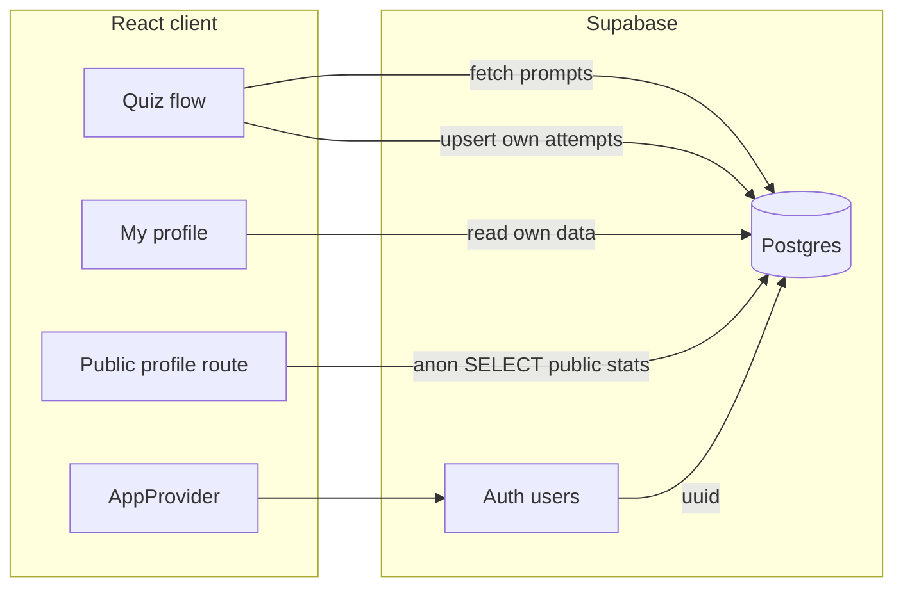

# Move geography-quiz to Supabase (DBML schema)

## Current baseline

- **Persistence today**: `[src/services/storageService.js](src/services/storageService.js)` uses **IndexedDB** for `user_data` (daily challenge streak + `fullEntries`, per-country `matrix`, `learningRate`, `lastChecked`) and **localStorage** for metadata + `geography_quiz_user_id` (`[src/types/dataSchemas.js](src/types/dataSchemas.js)`).
- **Daily challenge today**: `[src/utils/filterCountryData.js](src/utils/filterCountryData.js)` shuffles all countries with `getDailySeed()` and takes 5; `[src/features/quiz/hooks/useQuizProgression.js](src/features/quiz/hooks/useQuizProgression.js)` picks **prompt modality** per country with the same seed pattern. You chose **server-defined** challenges instead.
- **Profile/stats today**: `[src/utils/statsService.js](src/utils/statsService.js)` aggregates the in-memory **3×3 matrix** (and related helpers). That stored structure will be **removed**; the UI should build the same _style_ of aggregates **from `challenge_attempts`** (and/or `learning_rate` where appropriate).
- **Dependency note**: `[package.json](package.json)` does not yet include `@supabase/supabase-js`; `[.env.example](.env.example)` already documents `VITE_SUPABASE_URL` / `VITE_SUPABASE_ANON_KEY`. `@react-oauth/google` is present but unused—prefer **Supabase’s built-in Google provider** so one auth pipeline owns session + `user.id`.

## Authentication (Google OAuth)

- **Supabase Dashboard**: Enable **Google** provider; add OAuth client id/secret; set **redirect URLs** (local dev + production, e.g. `https://<project>.supabase.co/auth/v1/callback` and your app’s auth callback if you use PKCE flow on static hosting).
- **Client**: `supabase.auth.signInWithOAuth({ provider: 'google' })` and `onAuthStateChange` / `getSession` for `[AppProvider](src/state/AppProvider.jsx)`.
- **Profile row**: On first sign-in, ensure a `profiles` row exists (`id` = `auth.users.id`) via trigger or upsert—see **Email hygiene** below for which columns to fill.

## Schema mapping (DBML → Supabase Postgres)

Translate `[database.dbml](database.dbml)` into migrations with these practical adjustments:

| DBML                                               | Recommendation                                                                                                                                                                                       |
| -------------------------------------------------- | ---------------------------------------------------------------------------------------------------------------------------------------------------------------------------------------------------- |
| `users (id int, username)`                         | Prefer `**profiles`** with `id uuid PRIMARY KEY REFERENCES auth.users(id)` and optional `username`, instead of a separate integer user FK. All child tables use `**uuid` `user_id\*\*`=`auth.uid()`. |
| `countries (id, code)`                             | Seed from `[src/data/country_data.json](src/data/country_data.json)` (or a trimmed list). Keep `code` as your stable 3-letter key; app resolves `code` ↔ `countries.id` when talking to the API.     |
| `modalities` enum (`flag`, `map`, `name`)          | Match DBML in SQL; in JS map `**location` → `map**` at the boundary.                                                                                                                                 |
| `number` on `learning_rate.rate`                   | Use `real` or `double precision`.                                                                                                                                                                    |
| `challenge_attempts` unique `(user_id, prompt_id)` | Fits one completion row per prompt per user.                                                                                                                                                         |

**RLS (required)**:

- **Writes**: Users may `INSERT`/`UPDATE`/`DELETE` only **their own** `challenge_attempts` and `learning_rate` rows (`user_id = auth.uid()`).
- **Reads (game content)**: `challenges`, `challenge_prompts`, `countries` — readable to **authenticated** users (and `anon` if you want unauthenticated preview of daily structure; your call).
- **Reads (profiles / stats — public-by-design)**: Allow **`SELECT` for `anon` and `authenticated`** on the rows needed to render another user’s profile: e.g. `profiles` (only non-sensitive columns), `challenge_attempts` for that user, and related joins (`challenge_prompts`, `challenges`, `countries`). This keeps implementation **simple** (no `SECURITY DEFINER` RPC required); friends use the normal Supabase client with the anon key.
- **Still private**: Do **not** add an `email` column to `profiles` (or any table exposed by PostgREST) for this app. Email remains only in `auth.users`, which is **not** queryable with the anon key.

## Email hygiene (explicit checklist)

Google returns email to Supabase Auth, but **your public app surface should never show it** on profile pages or leak it via APIs.

1. **`profiles` columns**: Only safe, intentional fields—e.g. `id`, optional `display_name` or `avatar_url` from Google `raw_user_meta_data` if you copy them in a trigger. **No `email`.**
2. **Public / friend views**: Load data only from **`profiles` (restricted columns) + stats tables**. Do not call `supabase.auth.getUser()` on another user’s page; do not pass the signed-in user’s `session.user.email` into shared profile components.
3. **JWT/session**: The client session object can include email for the **logged-in** user; keep that out of React state that backs **public** routes, and avoid logging `user` to the console in production builds if it contains PII.
4. **Supabase settings**: Do not expose `auth` schema over PostgREST; keep using RLS on `public` tables only (default).

## Public profile links (friends view)

**Goal**: Any visitor with the link sees the same **read-only** stats UI (heatmap, timelines, etc.). **Canonical URL: `/profile/:userId`** where `userId` is the Supabase **`auth.users` id** (uuid)—same id used in `profiles.id` and `challenge_attempts.user_id`.

**Frontend**

- Route loads stats for **that** `userId` via the same queries as “my profile,” with editing/quiz actions hidden; header can show `profiles.display_name` (or similar), **never** email.
- **Copy link** on the signed-in user’s profile copies `/profile/<their uuid>`.

**Optional later** (if traffic or scraping becomes annoying): tighten `SELECT` policies and add a thin RPC or materialized public summary—**not** in scope given current priorities.

## Server-defined daily challenges

1. **Data model**: One `challenges` row per calendar `**day`\*\* (unique), with child `challenge_prompts` rows (`position`, `country_id`, `prompted_modality`) defining order and which modality is “prompted” for each of the five countries.
2. **Authoring pipeline** (pick one early; all are valid):

- **SQL seed / migration** for upcoming days (simplest to start), or
- **Supabase Edge Function** or external cron calling the API with **service role** to insert the next day’s rows, or
- Small **admin-only** UI using a privileged key (higher risk; keep behind auth + RLS bypass only server-side).

3. **Client changes** (core behavior shift):

- Replace the daily branch in `[prepareQuizData](src/utils/filterCountryData.js)` (shuffle + slice 5) with: **load today’s challenge** (by `CURRENT_DATE` or app timezone policy), join `challenge_prompts` → `countries.code`, order by `position`, build the same `quizData` array shape the quiz already expects.
- **Prompt generation**: For daily mode, **do not** call `generatePromptType` with a random seed for modality; use the `**prompted_modality`\*\* from each prompt row (still use existing mechanics for the two input modalities and review flow).
- **Completion**: On quiz complete, **upsert `challenge_attempts`** for each of the five `prompt_id`s with `name_score`, `flag_score`, `map_score` derived from the same skill-score logic you use today (`[storageService.js` / `quizEngine.js](src/services/storageService.js)`)—one row per prompt, three floats.

## Learning mode

- Continue spaced repetition in the client, but persist `**learning_rate**` (`user_id`, `country_id`, `last_checked`, `rate`) on updates instead of only `userData.countries[code]` in IndexedDB.
- Load due countries by querying `learning_rate` + country list (or join), replacing `[getCountriesDueForReview](src/utils/spacedRepetitionEngine.js)`’s dependence on the full local `userData` shape (keep the algorithm; change the input source).

## Profile / matrix from attempts

- Remove dependence on stored `**matrix**` for production paths.
- Add a **pure function** (e.g. in `statsService` or a new module) that, given rows from `challenge_attempts` joined with `challenge_prompts` (for `prompted_modality` and `country_id`), **bins scores into the same 3×3 interpretation** the UI expects: for each attempt, know which modality was prompted and which columns are name/flag/map scores, then aggregate into the heatmap inputs.
- Fix existing inconsistency: `[calculateAverageChallengePerformance](src/utils/statsService.js)` checks `.entries` but `[ProfilePage.jsx](src/features/profile/ProfilePage.jsx)` passes `fullEntries`—while refactoring, drive averages from **SQL aggregates** or from a normalized in-memory list built from `challenge_attempts` / challenge metadata.

## One-time migration from IndexedDB

**What can be migrated faithfully**

- **Per-country matrix**: Each stored scalar in `matrix[input][prompted]` is one past interaction (prompted vs input). Your choice: **each scalar becomes its own `challenge_attempt` row** requires a matching `challenge_prompt` (and `challenge`) because of FKs.
  - **Practical approach**: Insert a dedicated `**challenges` row** (e.g. `day = '1970-01-01'` or a named migration sentinel) and, for each matrix cell with history, create **synthetic `challenge_prompts`** (`country_id`, `prompted_modality` from column index, synthetic `position`), then one `**challenge_attempts` row per scalar** with the skill score placed in the **input** modality’s column (`name_score`/`flag_score`/`map_score`) and **0 or NULL** in the others—**only if** you make those columns nullable or accept zeros for “not measured.” If you want strict NOT NULL three-float rows, merge multiple scalars that share the same synthetic prompt (only possible when they belong to the same logical prompt—usually not for matrix backfill), so **nullable per-modality scores** are the flexible choice for backfill + future-proofing.
- `**learning_rate`\*\*: Straightforward map from `lastChecked` + `learningRate` per country code → upsert by `country_id`.

**What cannot be fully reconstructed**

- `[saveDailyChallenge](src/services/storageService.js)` currently appends `fullEntries` with only `{ date, skillScore, score }`—**no per-country modality breakdown** is stored there. Old **daily timelines** cannot be re-split into real `challenge_attempts` without that data. Plan options: (a) accept timeline loss for historical days, or (b) keep a small `**daily_challenge_summary`\*\* table for legacy `fullEntries` import only (extends beyond DBML—only if you care about the old graph).

**How to run migration**

- Dev-only script or one-shot UI flow: read IndexedDB + localStorage, map `localUserId` → **Supabase user after sign-in**, then bulk insert via **service role** (server script) or user session with RLS if policies allow insert into synthetic challenge rows. Prefer **service role in a CLI** to avoid widening RLS.

## Application integration steps

1. Add `@supabase/supabase-js`, add `[src/lib/supabaseClient.js](src/lib/supabaseClient.js)` (or similar) reading `import.meta.env.VITE_SUPABASE_*`.
2. **Auth gate**: Require sign-in for cloud persistence (**Google OAuth** as above). Wire session into `[AppProvider](src/state/AppProvider.jsx)`: load `user.id` + `profiles` row; replace `localUserId` with `user.id` for URLs and FKs.
3. **Replace or narrow `storageService`**: Either a **facade** (`local` when offline / logged out, `remote` when signed in) or a clean break to remote-only after migration. Given your direction, target **remote-first** with optional short transition.
4. **Tests**: Update `[src/test/data/mockUserData.js](src/test/data/mockUserData.js)` and any stats tests to use **attempt-based** fixtures instead of matrix objects.

## Files likely touched (non-exhaustive)

- New: `supabase/migrations/*.sql`, `src/lib/supabaseClient.js`, optional `scripts/migrate-indexeddb.mjs`, public profile route under `[src/features/profile/](src/features/profile/)` or `[src/components/](src/components/)`
- Major edits: `[src/services/storageService.js](src/services/storageService.js)`, `[src/utils/filterCountryData.js](src/utils/filterCountryData.js)`, `[src/features/quiz/hooks/useQuizProgression.js](src/features/quiz/hooks/useQuizProgression.js)`, `[src/state/AppProvider.jsx](src/state/AppProvider.jsx)`, `[src/utils/statsService.js](src/utils/statsService.js)`, profile components under `[src/features/profile/](src/features/profile/)` (extract shared presentational pieces for “my profile” vs “public profile”)
- Config: `[package.json](package.json)`, `[.env.example](.env.example)` (document service role only for migration CLI, never in Vite client)

## Risk / decision checkpoints

- **Timezone**: Define whether `challenges.day` is UTC or user-local midnight so “today” matches your product expectation.
- **Nullable attempt scores**: Strongly recommended for matrix backfill and partial saves; adjust DBML in SQL if you want strict NOT NULL.
- **GitHub Pages**: If the app stays static-hosted, Supabase anon key + RLS is fine; any **service-role** migration must run locally or in CI, never in the browser bundle.
- **Public stats**: Anyone with the profile URL (or broad `SELECT` if you allow listing) can read stats; acceptable for this product. If you later need privacy, reintroduce opt-in or RPC-scoped aggregates.
- **Email**: Re-verify after each auth/profile change that **no** API or UI path returns another user’s email; `profiles` migration should not add an email column.
